# Trading : Technical Analysis
* Price at which to buy and sell stock, risk involved, expected reward, exptected holding period
* Scan opportunity on the current trend
* Identify a short term trade
* frequent short term trading opportunity, small but consistent profits
* Holding period is few minutes to few weeks
* Can be applied to any assest class with historical time series data
* TA cares only about the stocks past trading data (price and volume) and predict the future movement
* Markets discount everything, how is more important than why, price moves in trend, history tends to repeat itself
* Stock Market timing: 9:15 AM to 15:30 PM
* The Open (first price trade executes), The high (highest transaction price for a day), The Low, Close price (final price at which the market closed)

### Common jargons
* Bull Market (Bullish) : expect the stock price to go up
* Bear Market (Bearish) : expect the stock price to go down
* Trend: general market direction (bearish, sideways and bearish)
* Fave value (FV) / par value : nominal value of a share
* 52 week high/low: sense of range within which the stock trades during the year
* All-time high/low: 
* Upper and Lower circuit: excjhange sets up a price band within which the stock can be traded on a given day
* Long position: buy a share with the exectation that the index will trade higher (bullish)
* Short position: Sell a share to someone which you dont own (with the assumption that the price of stock when bought would be less than the pice at which it was sold), must buy back the stock in the same day (or short in derivatives segment and carry forwrd the position for a few days)
* Square off: intend to close an existing position
* Intraday position: intend to square off the position withing the same day
* OHLC: Open, high, low and close
* Volume: total transactions (buy and sell) for a stock on a day
* Market segment: division based on financial instrument traded
    * Capital Market (CM): tradable securities and exchange-traded funds (ETFs)
    * Furures and Options (FO): equity derivate segment (leveraged products traded)
    * Currency Derivatives (CDS): currency pairs traded (via futures and options)
    * Wholesale Debt Market (WDM): fixed income securities (government securities, treasury bills, bonds )

### Charts
* Line Chart : Plot the closing price dots
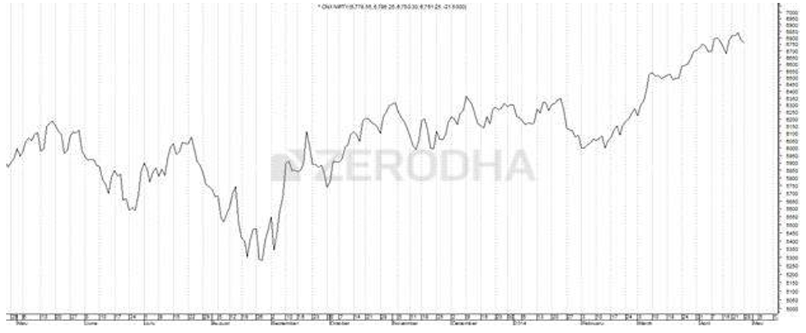

* Bar Chart: Bar's top is high, bottom is low, left mark/tick is open and right mark/tick is close, blue (bullish), red (bearish)
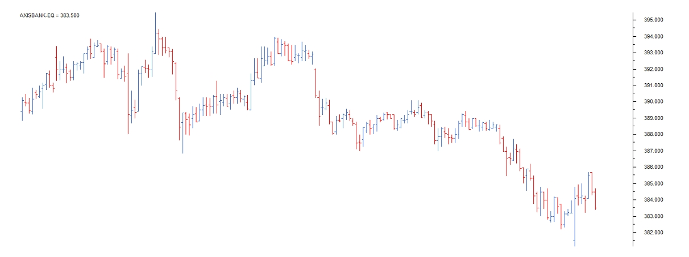

* Japanese candlestick
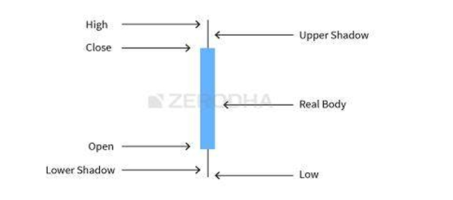

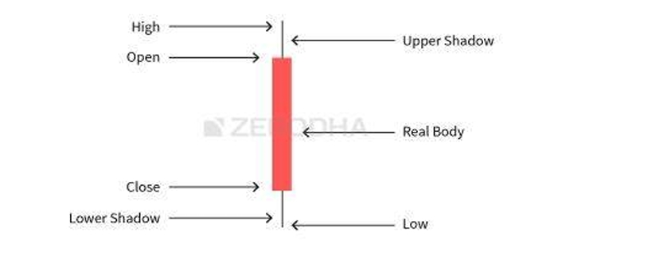

Long body indicates strong buying and selling activity ad short bbody depicts less trading activity and hence less price movement
* Time frame: duration of TA

### Candlestick patterns
* Buy strength (bullish) and sell weakness (bearish)
* Be flexible with patterns and quantify the flexibility to verify
* Look for prior trend (looking at bullish, prior should be bearish, ...)
* USe length of candle to qualify a trade
* Single candlestick patterns
    1. The Marubozu (Bald) pattern
    * Can appear anywhere in the chart, irespective of the prior trend
    * No upper and lower shadow
    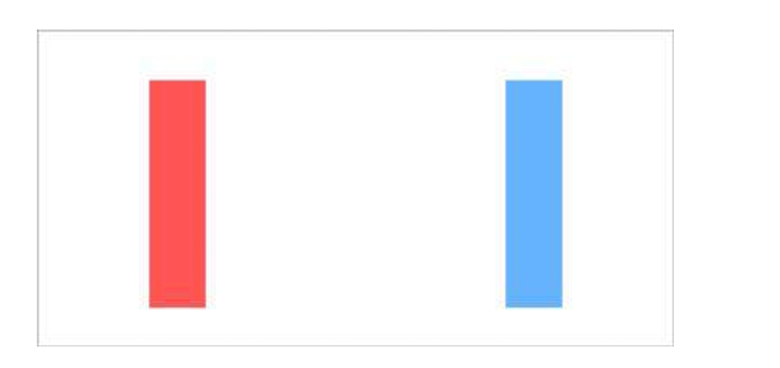
    * Bullish: much buying interest (ppl were willing to buy stock at every price point, so stock closed near its high end)
    * the bullish sentiment will continue over the next few trading sessions -> Buying opportunities (buy price around the closing price)
    * High and low can be off by some margin
    * Buy price Around closing price (high), stop loss (low of the candle), sell on bearish (red candle)
    * Bearish (Red Candle)
    * Much selling presssure (ppl are willing to sell at every price point, stock closed near its low end)
    * Short at closing price, with stoploss at the high price
    * Hold until the target is hit or stoploss is breached
    * Avoid trading during extremely smal (below 1% range) or long candle (above 10%) -> problem with stoploss placement

    2. The Spinning Top
    
    * Small real body, almost same upper and lower shadow
    * Bulls tried to take over but couldn't succeed (upper body), Bears tried to take up the market but couldn't succeed (lower body) 
    * Indicated indecision and uncertainity
    * Movement is certain but no certainity of the direction
    * Spinning tops in a downtrend: bulls tried to take up the trends, bears were in control, market can go up or continue down, trader can put in half the amount intended, which means they bought at the lowest price (reverese, buy more afterwards) or exit the trade with a loss
    * Spinning tops in uwardtrend: 

    3. The Dojis
    * Open and close price are almost equal
    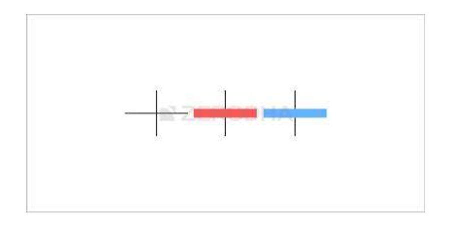
    * Same analysis as the spinning top

    4. Paper Umbrella
    * Haning Man (Bearish) or Hammer (Relatively Bullish)
    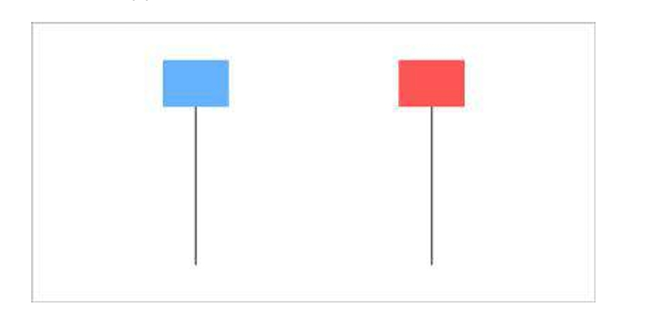
    * long lower shadow (at least twice the body) with a small upper body
    * Hammer: paper umbrella at the bottom of downward trend
        * Market trend downwards, next day market opens lower than previous day, but when pattern is formed, at the lower point ther is some buying interest that pushes the price higher to the extent the stock closes near the high point of the day
        * Bulls attempted to break the price from failing further and were reasonably successful
        * Low is the stop loss
        * Can go long
    * Hanging Man: paper umbrella at the top end of an upward trend
        * Trend is upwards and umbrella pattern appears
        * BEars have entered (long lower shadow)
        * Short position, high acts as a stoploss
    * Hammer preferred over hanging man
    
    5. The shooting star
    * Inverted paper umbrella, long upper shadow
    * It is bearish pattern, prior trend should be bullish
    * Short posotion, stoploss high 
* Multiple candlestick patterns
    * Look at 2 or 3 candlesticks to identify a trading opportunity
    1. The Engilfing Pattern
    * Bullish engulfing pattern
        * Downtrend
        *  P1 should be red candle (bearish), P2 should be blue candle long enough to engulf red candle
        * P2 there is record low, and there is a sudden buying interest which drives the price to close higher then previous day's open (bulls succeeded)
        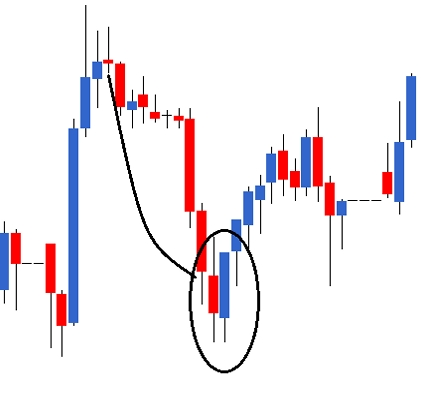
        * Buy at close price on P2, stoploss is lowest low of P1 and P2
        * Engulf the entire stick or just the body
    * Bearish engulfing pattern
        * Uptrend
        * P1 should be blue candle (bearish), P2 should be red candle long enough to engulf blue candle
        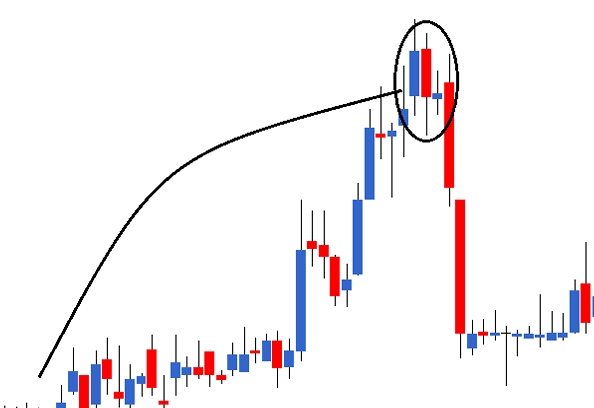
        * Open on P2 is higher than P1's close, P2 current market price is lower than P1's open price
        * Short trade, sell at close of P2, stop loss buy at max of P1 and P2 high
    * Presence of doji
        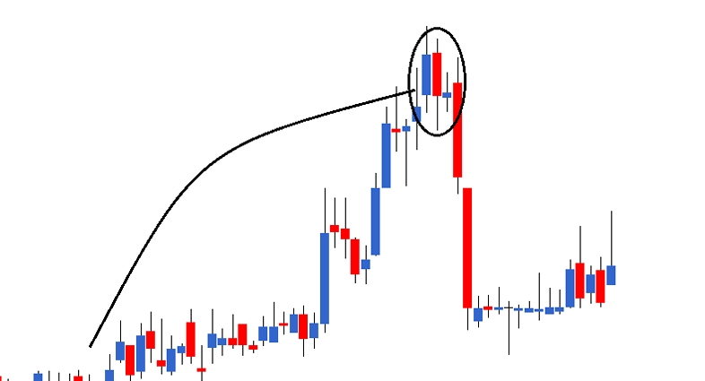
        * On P2, bulls panicked and on P3, bulls were uncertain
        * Panic with uncertainity - perfect for a catastrophe
        * Doji with a recognizable pattern, extremly profitable trend
    
    2. The piercing Pattern
    * Like bullish englufing pattern, but P2's blue candle partially engulfs P1's red candle (between 50 to 100%). 
    * Same opportunity as bearish engulfing pattern
    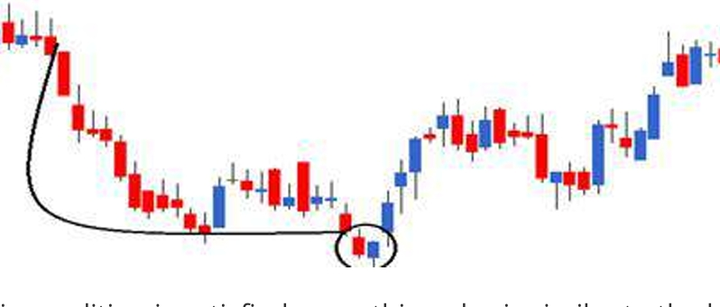

    3. The Dark Cloud cover
    * Similar to bearish engulfing pattern with P2's red candle engulfs 50-100% of P1's blue candle
    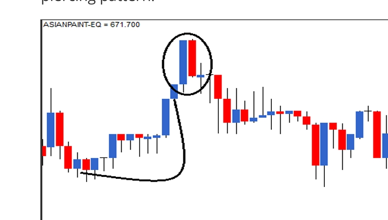

    4. The Harami (Pregnant) Pattern
    * First candlestick is long, the second is short with opposite color
    * Bullish Harami
    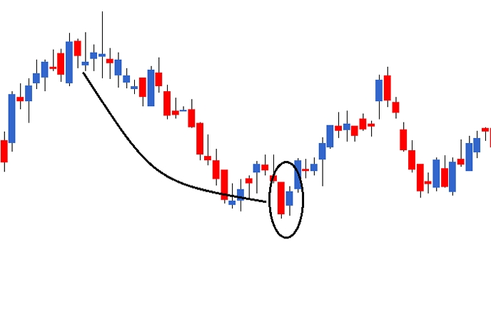
        * On P2, market opens at a price higher than the previous close, bears panic, market gains strength and closes positive just below P1 open.
        * Bulish candle appears all of a sudden, which encourages bulls and unnerves the bears
        * Go Long, buy at closing price with stop loss of the low of P1 and P2
    * Bearish Harami
    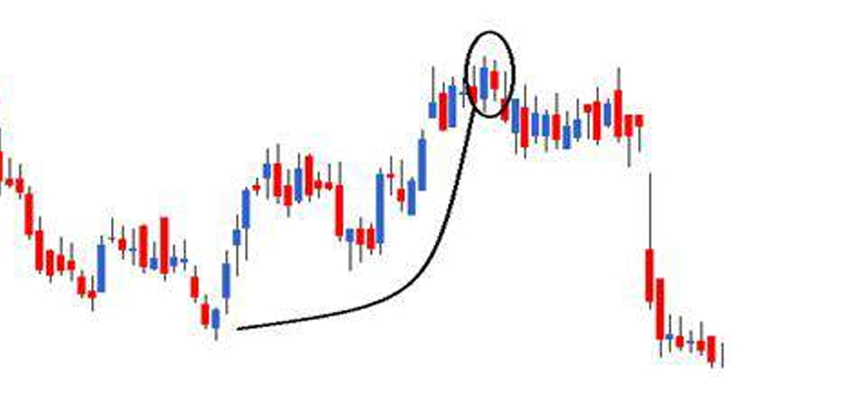
        * Short position: Sell at slosing price with stop loss at high of P1 and P2
* Gap: stock closes at one price but opens at a different price, due to some events (quaterly results annoucement)
* Gap up opening and Gap down opening

    5. The Morning Star
    * Bullish pattern over 3 days
    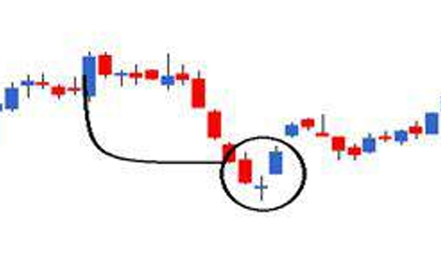
    * Strong P1 bearish, P2 gap down opening with Doji (not much activity after oprning gap down), P3 gap up opening followed by bullish candlestick
    * Buying opportunity, stop loss is lowest of the pattern

    6. The Evening Star
    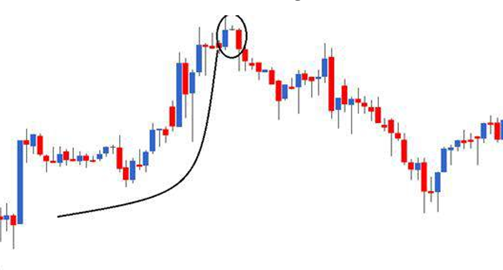
    * P1 upward bullish candle stick, P2 gap up opening with a doji, P3 gap down opening with red candlestick
    * Shorting opportunity, with stoploss max of the pattern

### The Support and Resistance
* Used to calculate the target price
* 